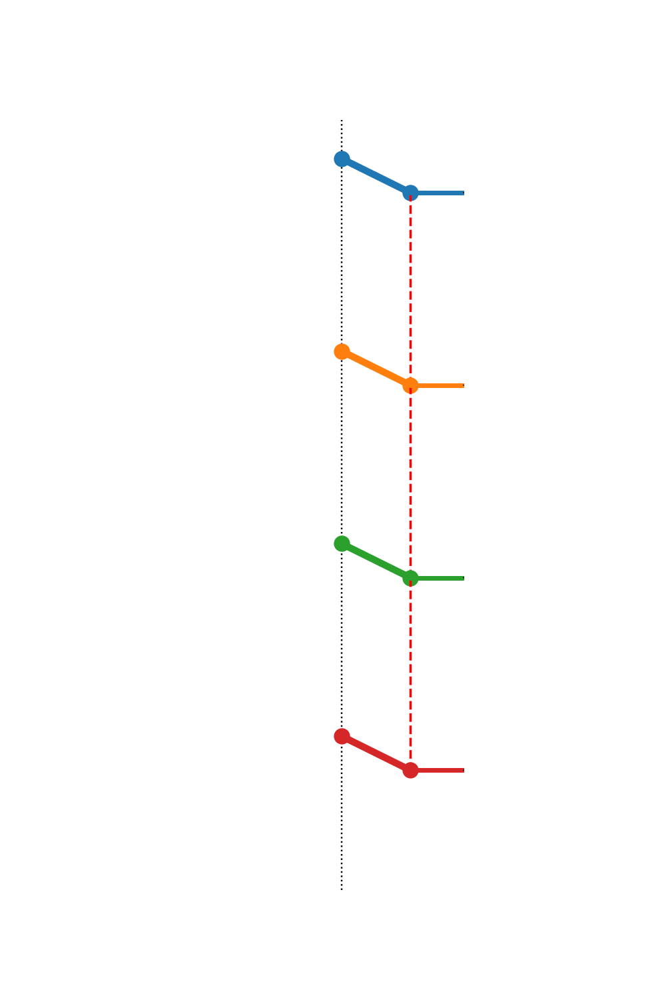
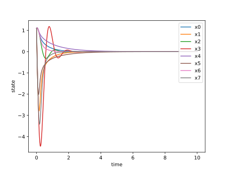
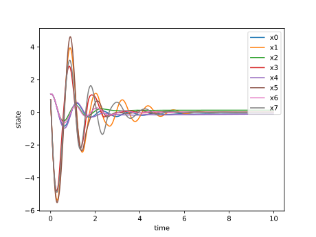
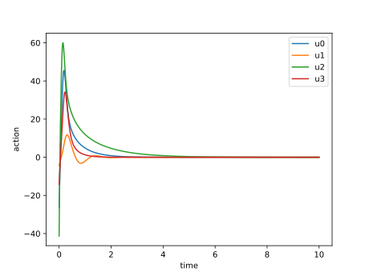
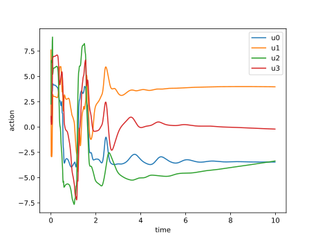
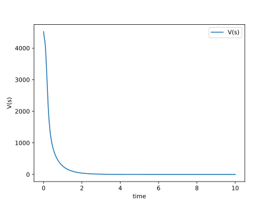
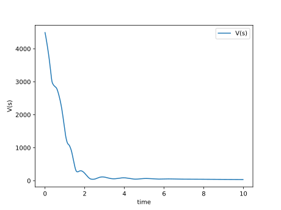
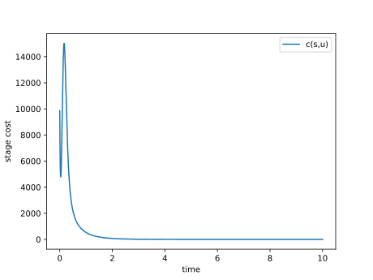
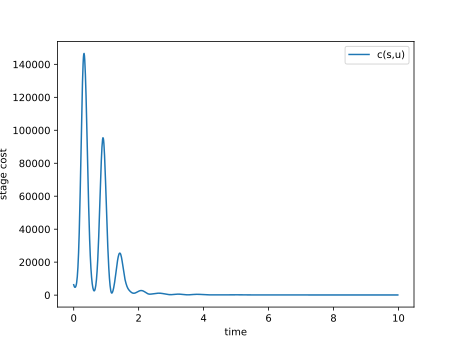

# Generating Informative Benchmarks for Reinforcement Learning

`publ2025-code-converse` contains **two demonstrations**, one of sensetivity testing, and the other of capabilities of problem generators.

## 📋 Overview
The first demonstration or experiment compares RAdam and Adam optimizers in reinforcement learning using converse optimality. The study employs dynamically generated control systems with multi-dimensional truncated Fourier series dynamics. System generation uses fixed seeds for reproducibility, while neural network initialization remains stochastic, enabling rigorous optimizer evaluation under controlled conditions.
For the N-crank demonstration:
<ul>
  <li>
    We’re benchmarking controllers on a parametrized N-crank mechanical system—cranks linked by springs and governed by trigonometric coupling—so the dynamics are highly nonlinear and underactuated.
  </li>
  <li>
    By sampling diverse parameter sets with our symbolic <code>gen_params</code> problem-generator, we test PPO, SAC, and A2C and compare them to the analytic optimal policy <em>a* = −&frac12; G<sup>T</sup>∇V</em>.
  </li>
  <li>
    This showcases the generator’s power and the strength of combining symbolic-numeric workflows with RL to tame challenging nonlinear control tasks.
  </li>
</ul>


# publ2025-code-converse  🛠️⚙️🎞️  

> Symbolic N-crank benchmark & RL controllers (PPO | A2C | SAC | Optimal | u=0)

<div align="center">

<table>
  <tr>
    <td></td>
    <td></td>
    <td></td>
    <td></td>
    <td></td>
  </tr>
  <tr>
    <td align="center">PPO</td>
    <td align="center">A2C</td>
    <td align="center">SAC</td>
    <td align="center">Optimal</td>
    <td align="center">Uncontrolled</td>
  </tr>
</table>

</div>
Cranks & Shafts (Leading Arms)
Our benchmark system consists of an N-crank (in our example N=4) chain in the plane. Each crank is a rigid link (length L) that pivots at its base and is free to rotate under applied torque uᵢ. We denote its angular position by xᵢ and its angular velocity by yᵢ.

The shafts (sometimes called leading arms) are the same rigid links, but thought of as the “arms” that transmit torque from the actuator at the pivot out to the crank tip. In our model each tip is attached to its neighbor via a rotary spring of stiffness Kᵢ, so adjacent cranks interact through the springs connecting their tips. Physically, you can imagine a row of motors (one per crank) driving equally long arms, with springs strung between their ends.

* Pivot (base): fixed joint.
* Link (shaft/arm): rigid bar of length L rotating about its pivot.
* Tip coupling: spring connecting neighbouring tips to introduce coupling forces.
* Leading arm: where control force is applied.
* An arrow at the  of the leading arm indicating the direction of the control.

Together this creates a highly nonlinear, underactuated chain of rotating shafts whose angles and velocities form our 2_N_–dimensional state. Control inputs u₀…uₙ₋₁ are the torques at each pivot, and the resulting tip–tip spring forces make the dynamics richly coupled and ideal for testing.

[▶ Jump to Experiment 2](#exp2)

## 🚀 Quick Start

### Installation
```bash
git clone https://github.com/converseoptimality/RL-Benchmarking.git
cd RL-Benchmarking
python3 -m venv rl_opt_env
source rl_opt_env/bin/activate  # Linux/MacOS
# or .\rl_opt_env\Scripts\activate for Windows

pip install -r requirements.txt
```
## 🔬 Experiment 1 Execution
To reproduce the experiments with fixed system generation seeds while allowing neural network weight initialization variability:

#### Run the full experiment (160 runs: 80 RAdam + 80 Adam)
```python3 main.py```

### Visualize results using TensorBoard
```
tensorboard --logdir=multi_opt_full_experiment/ --port 8888
# Extract the final values using 
python3 exstract_csvs.py # Change the URL to the new downloading link from tensorboard localhost
```


### Immedieatly Analyse our existing data
we already have saved all 160 CSVs in a file named "Combined_CSVs" and extract the final rewards then perform one of the latter tests.

#### Generate statistical analysis plots
```python tensorboard_boxplot.py  # Comparative performance distributions
python3 analysis_scripts/tensorboard_fscore.py   # F-test significance analysis
python3 analysis_scripts/tensorboard_hist.py     # Reward distribution histograms
python3 analysis_scripts/tensorboard_boxplot.py  # Comparative performance distributions
python3 analysis_scripts/Final_Rewards_Distribution_KDE.py # Generate the final reward distribution using a gaussian kernal

```
### Configuration Details
The PPO algorithm is configured with the following hyperparameters:

## Hyperparameters

The following hyperparameters were used for the PPO algorithm:

| Parameter         | Value      | Description                                                                 |
|-----------------|------------|-----------------------------------------------------------------------------|
| `optimizer_class` | Adam, RAdam | The optimizer used for training (Adam and RAdam were compared).           |
| `learning_rate` | 3e-4       | Learning rate for the optimizer.                                           |
| `n_steps`         | 2048       | Number of steps before updating the policy.                               |
| `batch_size`     | 64         | Batch size used during training.                                            |
| `n_epochs`        | 10         | Number of epochs per update.                                                |
| `gamma`           | 0.99       | Discount factor.                                                            |
| `gae_lambda`      | 0.95       | Lambda parameter for generalized advantage estimation.                     |
| `clip_range`      | 0.1        | Clipping range for the policy update.                                     |
| `ent_coef`        | 0.01       | Entropy coefficient for encouraging exploration.                           |
| `max_grad_norm`   | 0.3        | Maximum gradient norm for clipping gradients.                              |
| `net_arch`        | [64, 64]   | Neural network architecture for both policy and value function (hidden layers). |
| `features_dim`    | 128        | Dimensionality of features extracted from the input.                       |


### Neural Network Architecture

A custom multilayer perceptron (MLP) (`CustomMLP`) was used as the neural network architecture, with the hyperparameters defined above. The architecture remained consistent for both Adam and RAdam experiments, allowing for a fair comparison.
```
{
  "features_extractor": "CustomMLP(128)",  # State feature extraction
  "pi": [64, 64],  # Policy network layers
  "vf": [64, 64],  # Value function network layers
  "optimizer": ["RAdam", "Adam"]  # Optimizer variants
}
```
## 📊 Results 

The following figures summarize the results of the experiment:

* F-test plot comparing the distribution of rewards (please add description).
 
* Kernel Density Estimate (KDE) plot visualizing the reward distributions for Adam and RAdam.

* Box plot comparing the final rewards obtained using Adam and RAdam optimizers.
")
<a name="exp2"></a>
## Experiment 2 Details
### install new dependencies
```
pip install -r requirements2.txt   # extra deps
```

### Training all algorithms
```
python3 train_all_crank.py --run_both
```
### Training with different variables

The `train_all_crank.py` script accepts these flags:

```bash
  --algo {ppo,a2c,sac}             # which algorithm to train (default: ppo)
  --run_both                       # train PPO, A2C and SAC in sequence
  --timesteps TIMESTEPS           # total training timesteps (default: 2_000_000)
  --dt DT                          # integration timestep used for reward scaling (default: 0.01)
  --max_episode_steps STEPS       # max steps per episode (default: 700)
```
**Example**
```
python train_all_crank.py --algo a2c \
  --timesteps 500000 \
  --dt 0.005
```

### Evaluate (deploying) saved models
* Be aware if you train new model, you need to replace thier names in `eval_all_with_sim_cranks.py`
here:
```
    "ppo"         : (lambda: simulate_ppo(system, "crank_models/ppo_20250509_012547_dt_0.010", dt=0.01), PPO),
    "sac"         : (lambda: simulate_sac(system, "crank_models/sac_20250508_020749_dt_0.010", dt=0.01), SAC),
    "a2c"         : (lambda: simulate_a2c(system, "crank_models/a2c_20250509_022254_dt_0.010", dt=0.01), A2C),
```
* Evaluating the existing models
```
python3 eval_all_with_sim_cranks.py
```

#### **Comparison runs**  
   - **RL algorithms** like PPO on same plant  
   - **Uncontrolled** (u=0)  
   - **Optimal**  

#### **Outputs**  
   - `plots/ppo.gif`, `plots/uncontrolled.gif`, `plots/optimal.gif`  
   - CSVs: `plots/data/{label}_*.csv`  
   - Value‐function & stage‐cost time series plots  


### Changing the system / multiple systems
All physical parameters live in crank_system.py and are sampled by
gen_params(n_samples).

To train on K different plants:
```
for ps in gen_params(K):
    system = build_system(ps)
    ...  # call train_all_crank.py with --model_out crank_models/<tag>_<idx>.zip
```

## 📊 Results: Experiment 2
## Results

Below are a few representative plots generated from the `results/` directory. Feel free to click any image to see the full-size version.

## Comparison: Optimal vs A2C

### State Trajectories

| Optimal | A2C |
|:--------:|:---:|
|  |  |

### Control Signals

| Optimal | A2C |
|:--------:|:---:|
|  |  |

### Value Function Over Time

| Optimal | A2C |
|:--------:|:---:|
|  |  |

### Instantaneous Stage Cost

| Optimal | A2C |
|:--------:|:---:|
|  |  |


> **Tip:** You can find analog plots for A2C, PPO, Optimal, and Uncontrolled in `results/plots/`—just swap the `ppo_` prefix with `a2c_`, `sac_`, `optimal_`, or `uncontrolled_`.

---

## Monitoring Training with TensorBoard

All training runs log TensorBoard summaries under `logs_cost/`. To launch:

1. Install TensorBoard (if necessary):
   ```bash
   pip install tensorboard
2. Start TensorBoard, pointing to your logs directory:

```
tensorboard --logdir logs_cost/
```
Open your browser at http://localhost:6006 to explore:

Scalars: episode reward, loss terms, learning rate

Histograms: action and value distributions

Graphs: policy & value networks


<!-- Citation placeholder -->
<section id="references">
  <h2>Citation</h2>

  ```
@article{yamerenko2025generating,
  title={Generating Informative Benchmarks for Reinforcement Learning},
  author={Yamerenko, Grigory and Ibrahim, Sinan and Moreno-Mora, Francisco and Osinenko, Pavel and Streif, Stefan},
  journal={IEEE Control Systems Letters},
  year={2025},
  publisher={IEEE}
}
```
  <ul>
    <!-- Add your citations here -->
  </ul>
</section>

Happy experimenting! 🎞️🛠️
